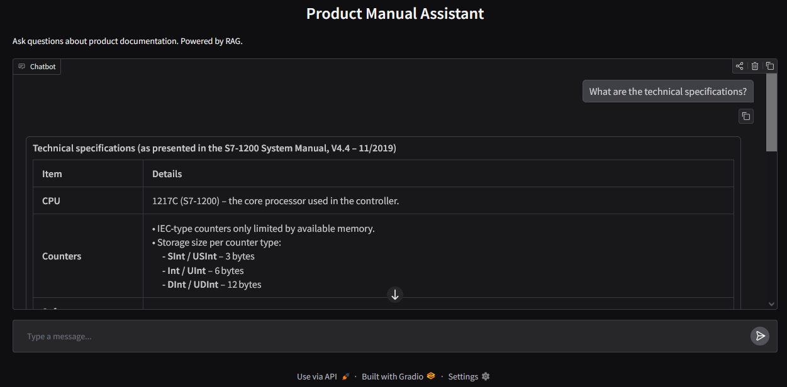

# Product Manual Assistant

A RAG (Retrieval-Augmented Generation) chatbot that answers technical questions about product documentation. Built with LangChain v1, HuggingFace, and ChromaDB.


## Demo



## Overview

The user can ask natural language questions about product documentation and receive accurate, context-grounded answers. Instead of searching through hundreds of pages manually, the chatbot retrieves the most relevant sections and generates relevant response.

Drop any product manual PDF into the `data/manuals/` directory, run the ingestion pipeline, and start asking questions.

## How It Works

1. **Document Ingestion:** PDF files are split into chunks and converted into embeddings, then stored in ChromaDB.
2. **Query Processing:** The user's question is matched against stored chunks to find the most relevant ones.
3. **Response Generation:** The relevant chunks are passed to the LLM as context then it uses them to answer the question.

## Architecture

```
User Question
      │
      v
┌─────────────┐     ┌──────────────┐      ┌─────────────┐
│  Embed Query│───> │  ChromaDB    │────> │ Top-K Chunks│
│  (MiniLM)   │     │  Similarity  │      │  Retrieved  │
└─────────────┘     │  Search      │      └──────┬──────┘
                    └──────────────┘             │
                                                 v
                                       ┌──────────────────┐
                                       │  Dynamic Prompt  │
                                       │ (System + Context│
                                       │  + User Query)   │
                                       └────────┬─────────┘
                                                │
                                                v
                                       ┌──────────────────┐
                                       │   HuggingFace    │
                                       │   Inference API  │
                                       │   (GPT-OSS-20B)  │
                                       └────────┬─────────┘
                                                │
                                                v
                                          Answer to User
```

## Tech Stack

| Component | Technology |
|-----------|-----------|
| Framework | LangChain v1 |
| LLM | openai/gpt-oss-20b (HuggingFace API) |
| Embeddings | sentence-transformers/all-MiniLM-L6-v2 (HuggingFace API) |
| Vector Database | ChromaDB (persistent, local) |
| Frontend | Gradio |
| Agent Runtime | LangGraph (via create_agent) |
| Document Loader | LangChain PyPDFLoader |
| Text Splitting | RecursiveCharacterTextSplitter |

## How to Run

### Prerequisites

- Python 3.11
- Anaconda or Miniconda
- A [HuggingFace account](https://huggingface.co/) with an API token

### Installation

1. Clone the repository:
   ```bash
   git clone https://github.com/alvinlitani/RAG-for-Product-Manual-Assistant.git
   cd product-manual-assistant
   ```

2. Create and activate the conda environment:
   ```bash
   conda create -n product-manual-rag python=3.11 -y
   conda activate product-manual-rag
   ```

3. Install dependencies:
   ```bash
   pip install -r requirements.txt
   ```

4. Create a `.env` file in the project root:
   ```
   HF_API_TOKEN=your_huggingface_token_here
   ```

5. Place one or more product manual PDFs in `data/manuals/`.

### Running

**Step 1: Ingest documents** (only needed once or when new PDF files are added)
```bash
python ingest.py
```

**Step 2: Launch the chatbot**
```bash
python app.py
```

Open the URL shown in the terminal (default: `http://127.0.0.1:7860`) to start chatting.

## Configuration

All key parameters are centralized in `config.py`:

| Parameter | Default | Description |
|-----------|---------|-------------|
| `LLM_MODEL` | `openai/gpt-oss-20b` | HuggingFace model for response generation |
| `EMBEDDING_MODEL` | `sentence-transformers/all-MiniLM-L6-v2` | Model for text embeddings |
| `CHUNK_SIZE` | `1000` | Characters per document chunk |
| `CHUNK_OVERLAP` | `200` | Overlap between consecutive chunks |
| `TOP_K` | `4` | Number of chunks retrieved per query |

## Design Decisions

- **LangChain v1 with create_agent**: Uses the current recommended approach as the old chain API is deprecated.
- **Naive RAG over advanced patterns**: A straightforward naive RAG is the right fit for a relatively simple use case (single document Q&A). Advanced patterns (query rewriting, re-ranking, agentic RAG) add latency and complexity and are better suited for multi-source or ambiguous query use cases. 
- **HuggingFace Inference API**: Zero cost, no GPU required, ability to work with open-source models, large choice set for models
- **ChromaDB vs FAISS**: Lightweight, persistent, no external server needed, no running in memory
- **Recursive splitting over fixed-size**: It tries to keep sentences and paragraphs intact instead of cutting blindly while maintaining target chunk size.

## Potential Improvements

- Structure-aware chunking to handle tables and section headers in the PDF files
- Contextual retrieval by adding section summaries to each chunk before embedding
- Conversational memory so users can ask follow-up questions
- Evaluation pipeline to measure how well the retrieval and responses perform